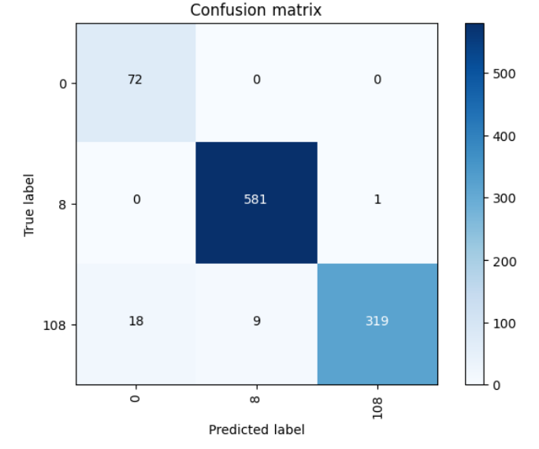
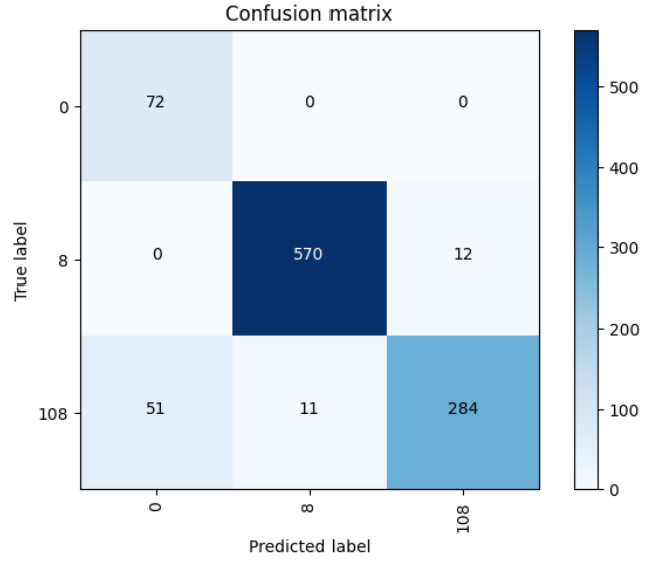

# Oil wells anomaly detection
## 🔎 Overview
This project focuses on detecting abnormal events in oil wells using time series data. It implements several 1D Convolutional Neural Network (CNN) architectures to classify time series data into three different categories of events (normal operation and two types of anomalies).

## 🧩 Project structure
The project is divided into two main parts:

1. **Theoretical explanation of why 1D CNNs are suitable for time series data**  
    → Presented in the [`preliminary-report.md`](./ressources/preliminary-report.md) file

2. **Implementation of multiple CNN models with comparative analysis**  
    → Developed in the [`oil-well-anomaly-detection.ipynb`](./oil-well-anomaly-detection.ipynb) notebook, and is also available in [`.html`](./oil-well-anomaly-detection.html) and [`.pdf`](./oil-well-anomaly-detection.pdf) formats for easier viewing

## 🗂️ Dataset
The dataset ([oil_wells_data.csv](./data/oil_wells_data.csv)) contains time series measurements from oil wells with the following features:

- `timestamp`
- Several pressure measurements (`P-*`)
- Several temperature measurements (`T-*`)
- `QGL`: Flow rate measurement (missing values)
- `class`: Target variable (0, 8, 108) indicating normal operation or specific anomalies

## 🧹 Data preprocessing

- Removal of empty columns (P-JUS-CKGL, T-JUS-CKGL, QGL)
- Feature normalization using `StandardScaler`
- Label encoding of the target variable
- Creation of sliding windows (size=25) with a stride of 1 to capture temporal patterns
- Stratified train-test split (80% training, 20% testing) to maintain class distribution

## 🧠 Model architectures
Four different CNN architectures were implemented and compared:

-  **Model 1**
    - 1D convolution layer
    - Max pooling
    - Dense layers

- **Model 2**
    - 2 stacked 1D convolution layers
    - max Pooling
    - Dense layers

- **Model 3**
    - 2 stacked 1D convolution layers
    - max Pooling
    - additional 1D convolution layer
    - max Pooling
    - Dense layers

- **Model 4**
    - 2 stacked 1D convolution layers
    - Max pooling
    - Additional 1D convolution layer
    - Max pooling
    - Dense layer
    - Dropout (0.5)
    - Output dense layer

## 🏋️‍♂️ Training process

- Early stopping was implemented to prevent overfitting
- Class weights were used to handle class imbalance
- RMSprop optimizer with sparse categorical crossentropy loss function
- Validation split of 20% during training

## 📈 Results
The models were evaluated on a random sample of 1,000 test points with the following metrics:

| Model 1 | Model 4 |
|--------|---------|
|  |  |
| **Accuracy**: 97.2% | **Accuracy**: 92.6% |
| **Precision**: 97.6% | **Precision**: 94.5% |
| **Recall**: 97.2% | **Recall**: 92.6% |
| **F1-score**: 97.2% | **F1-score**: 93.0% |

## ✨ Key findings

- The simplest model (Model 1) actually achieved the best performance, demonstrating that complex architectures aren't always necessary
- All models showed excellent performance on classes 0 and 8
- Class 108 was consistently more difficult to classify correctly, possibly because its feature values overlap with the other classes
- The addition of Dropout in Model 4 helped reduce fluctuations in validation metrics during training but did not improve final test performance

## 🎓 Academic context
This project was developed during the first year of the Master’s program in Data Science and Complex Systems at the University of Strasbourg.

## 📝 Documentation
All analysis details, code, and results are available in the [notebook](./oil-well-anomaly-detection.ipynb) (in french), along with [HTML](./oil-well-anomaly-detection.html) and [PDF](./oil-well-anomaly-detection.pdf) exports of the notebook for easier viewing.

A [preliminary theoretical report](./ressources/preliminary-report.md) (in french) explaining the relevance of 1D CNNs for time series data is also available.